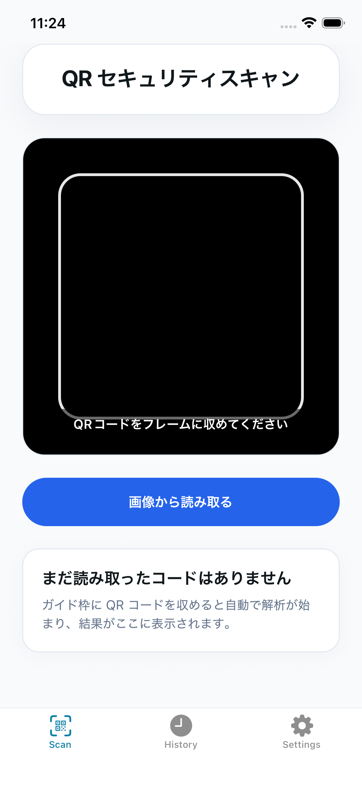
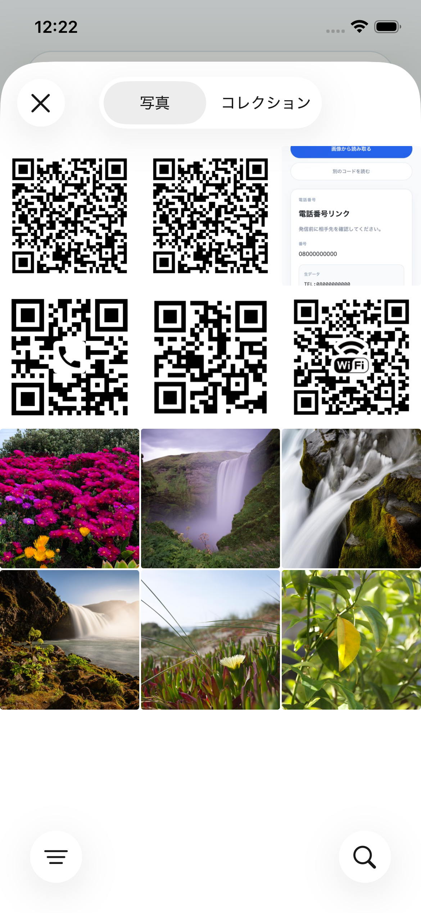
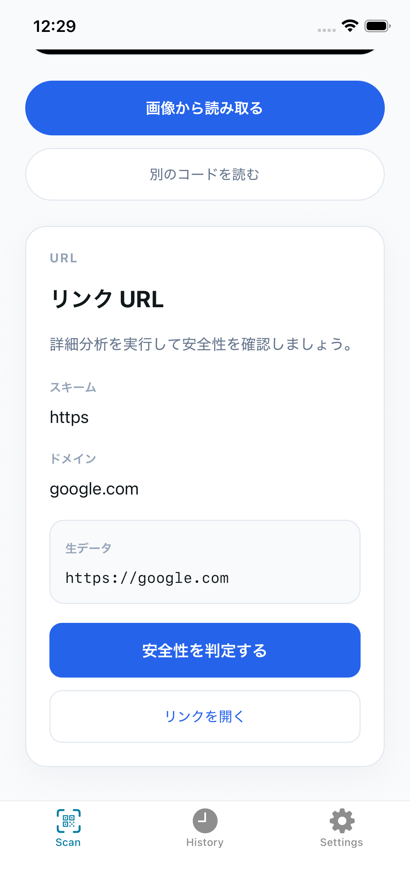
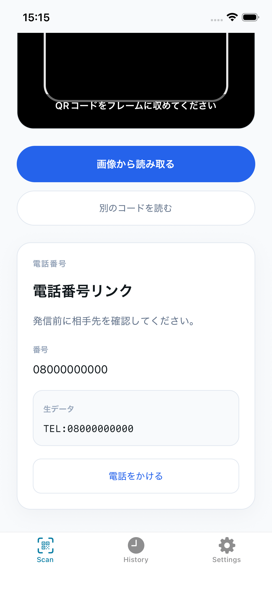
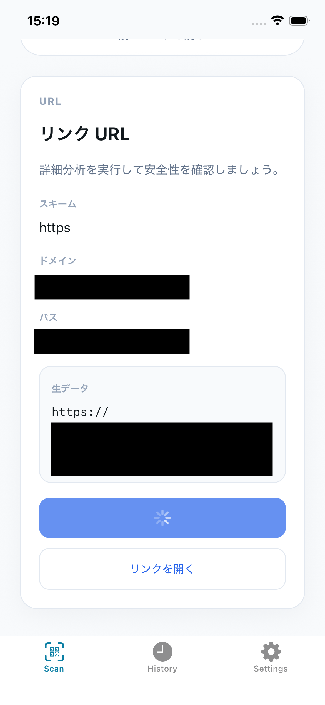
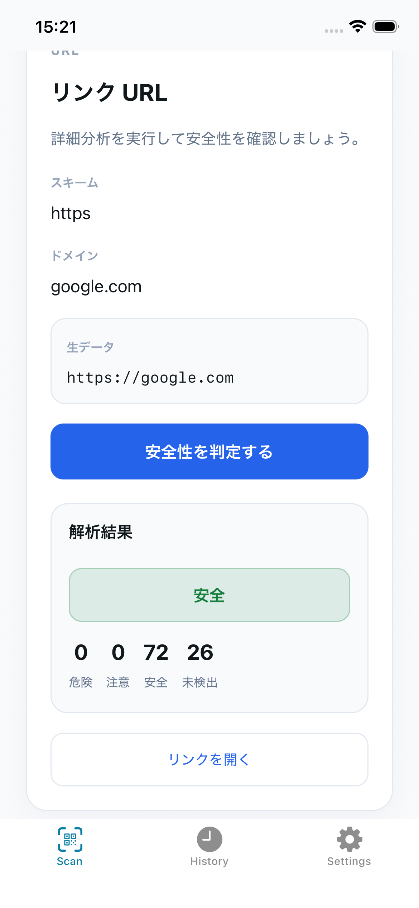
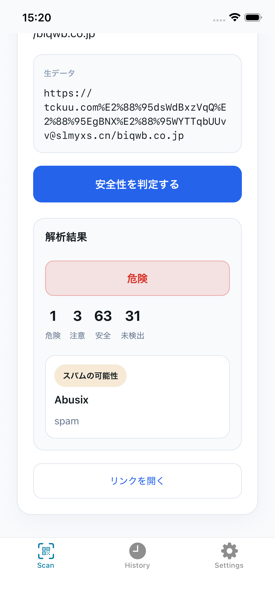
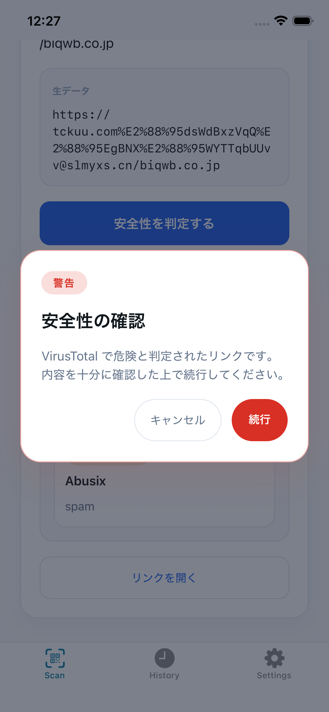
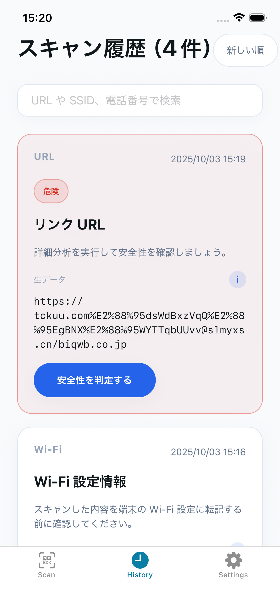
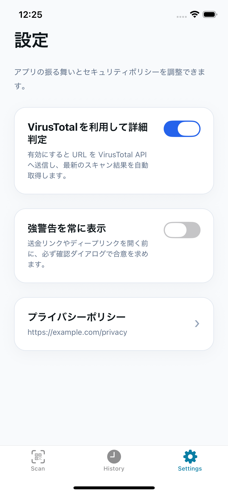

# Secure Code Reader - 使い方ガイド

このドキュメントでは、Secure Code Reader の具体的な使い方を画像付きで説明します。

## 目次
- [アプリの起動](#アプリの起動)
- [API設定](#api設定)
- [スキャンタブの使い方](#スキャンタブの使い方)
- [履歴タブの使い方](#履歴タブの使い方)
- [設定タブの使い方](#設定タブの使い方)

---

## アプリの起動

アプリを起動すると、カメラへのアクセス許可を求められます。「許可」をタップしてください。

 **注意**: カメラの権限を許可しないと QR コードのスキャン機能が利用できません。

---

## API設定

Secure Code Reader は、3つの設定方式から選択できます。用途に応じて設定してください。

### 方式1: VirusTotal APIを直接使用（推奨）

**設定方法:**
1. VirusTotal で API キーを取得（[https://www.virustotal.com/](https://www.virustotal.com/)）
2. プロジェクトの `config/local-api-keys.json` を開く
3. 以下のように設定：

```json
{
  "virusTotal": {
    "apiKey": "YOUR_VIRUSTOTAL_API_KEY"
  }
}
```

**機能:**
- ✅ URL解析: VirusTotal API で安全性チェック
- ✅ 決済QR判定: ローカル内部リストで判定

**メリット:**
- 外部サーバー不要
- 設定が簡単
- 決済サービス（PayPay、楽天ペイなど）を自動判定

---

### 方式2: BFF経由で使用（リリース向け実装）

> **注意:** この方式は、将来的な正式リリースを見据えた実装です。現在の開発・検証段階では**基本的に方式1または方式3の利用を推奨します。**
>
> リリース時には、BFFを通じて以下の高度な機能が提供される予定です：
> - 短縮URL展開やリダイレクト解析
> - クライアントにAPIキーを持たせないセキュアな構成
>
> BFFの利用が必要な場合は、開発チームにご相談ください。利用条件を満たす場合、baseURLとAPIキーを提供できる可能性があります。

**設定方法:**
1. 開発チームからBFFのエンドポイントとAPIキーを取得
2. `config/local-api-keys.json` を以下のように設定：

```json
{
  "virusTotal": {
    "apiKey": ""
  },
  "bff": {
    "baseUrl": "https://your-bff-endpoint.example.com",
    "apiKey": "YOUR_BFF_API_KEY"
  }
}
```

**機能:**
- ✅ URL解析: BFF 経由で VirusTotal チェック
- ✅ 決済QR判定: BFF の内部リスト（DynamoDB）で判定

**特徴:**
- 短縮URL展開やリダイレクト解析が可能
- 内部リストを動的に管理できる
- APIキーをクライアントに持たせない

---

### 方式3: 設定なし（内部リストのみ）

**設定方法:**
設定ファイルをデフォルトのまま使用：

```json
{
  "virusTotal": {
    "apiKey": ""
  }
}
```

**機能:**
- ❌ URL解析: 利用不可
- ✅ 決済QR判定: ローカル内部リストで判定

**メリット:**
- APIキー不要
- 決済QRコードの判定のみ利用可能

---

### 決済サービスリストのカスタマイズ

`config/local-internal-list.json` で決済サービスのドメインを追加・削除できます：

```json
{
  "paymentServices": [
    {
      "serviceName": "PayPay",
      "category": "決済サービス",
      "domains": ["paypay.ne.jp", "pay-web.paypay.ne.jp"],
      "notice": "PayPayの決済QRコードです。安全に利用できます。"
    },
    {
      "serviceName": "カスタム決済",
      "category": "決済サービス",
      "domains": ["custom-payment.example.com"],
      "notice": "カスタム決済サービスです。"
    }
  ]
}
```

**デフォルトで登録されているサービス:**
- PayPay
- 楽天ペイ
- LINE Pay
- au PAY
- d払い
- メルペイ

---

## スキャンタブの使い方

### 1. カメラでQRコードをスキャンする

アプリを起動すると、スキャンタブが表示されます。画面中央に表示される正方形のガイド枠に QR コードを合わせてください。



**ポイント:**
- QR コードがガイド枠内に収まるように調整してください
- 自動的に読み取りが開始されます
- 読み取りが完了すると、下部に結果が表示されます

### 2. 画像から読み取る

カメラでの読み取りの他に、既存の画像から QR コードを読み取ることもできます。

1. 画面下部の「画像から読み取る」ボタンをタップ
2. フォトライブラリから QR コードが含まれる画像を選択
3. 自動的に QR コードが解析されます



### 3. スキャン結果の確認

QR コードを読み取ると、ペイロードの種類に応じた結果カードが表示されます。

#### URL の場合



- **ペイロードタイプ**: URL であることが表示されます
- **元のテキスト**: QR コードに含まれていた生のテキスト
- **ホスト名**: URL のドメイン情報
- **リンクを開く**: ブラウザでリンクを開きます
- **安全性を判定する**: VirusTotal で URL の安全性をチェックします（APIキー設定時のみ）
- **決済QR判定**: ローカル内部リストで決済サービスを自動判定し、該当する場合は安全性情報を表示

#### 電話番号の場合



- **ペイロードタイプ**: 電話番号であることが表示されます
- **電話番号**: 抽出された電話番号
- **電話をかける**: 標準の電話アプリで発信画面を開きます

#### Wi-Fi 設定の場合


- **ペイロードタイプ**: Wi-Fi であることが表示されます
- **SSID**: ネットワーク名
- **暗号化方式**: セキュリティタイプ (WPA/WPA2 など)
- **Wi-Fi 設定を開く**: デバイスの Wi-Fi 設定画面を開きます

### 4. URL の安全性チェック

URL が検出された場合、以下の2つの方法で安全性をチェックできます：

#### 4-1. 決済QRコード判定（常に実行）

スキャン時に自動的にローカル内部リストと照合され、決済サービスの場合は以下のように表示されます：

**決済サービスと判定された場合:**
- サービス名（例: PayPay、楽天ペイ）
- カテゴリ（決済サービス）
- 安全性情報（例: "PayPay公式の決済QRコードです。安全に利用できます。"）

**登録されていない場合:**
- 内部リスト判定: 未登録

#### 4-2. VirusTotal解析（APIキー設定時のみ）

1. 「安全性を判定する」ボタンをタップ
2. VirusTotal での解析が開始されます
3. 解析中は「解析中...」と表示されます



**判定結果:**

**安全な場合**



- 緑色で「安全」と表示されます
- そのまま「リンクを開く」で安心してアクセスできます

**注意が必要な場合**

- オレンジ色で「注意」と表示されます
- リンクを開く際に確認ダイアログが表示されます

**危険な場合**



- 赤色で「危険」と表示されます
- リンクを開く際に必ず警告ダイアログが表示されます
- アクセスは推奨されません

> **注:** VirusTotal APIキーが設定されていない場合、「安全性を判定する」ボタンは表示されません。決済QR判定のみが実行されます。

### 5. リンクを開く際の確認ダイアログ

「注意」や「危険」と判定された URL、または設定で「強警告を常に表示」を有効にしている場合、リンクを開く前に確認ダイアログが表示されます。



- **キャンセル**: リンクを開かずに戻ります
- **開く**: 注意を承知の上でリンクを開きます

---

## 履歴タブの使い方

### 1. スキャン履歴の一覧

これまでスキャンした QR コードの履歴が最新 50 件まで保存されます。



**表示される情報:**
- ペイロードタイプ (URL / 電話番号 / Wi-Fi / テキスト)
- 元のテキストまたは主要情報
- スキャン日時
- 安全性判定結果 (URL の場合)

### 2. 履歴の検索とソート

履歴の上部には検索バーとソートボタンがあります。

**検索機能:**
- テキスト入力で履歴を絞り込むことができます
- URL、電話番号、Wi-Fi名などで検索可能

**ソート機能:**
- 「新しい順」: 最新のスキャンが上に表示されます (デフォルト)
- 「古い順」: 古いスキャンが上に表示されます
---

## 設定タブの使い方

アプリの動作をカスタマイズできます。



### 1. VirusTotal を利用して詳細判定

- **オン (デフォルト)**: URL スキャン時に VirusTotal API を使って安全性をチェックします
- **オフ**: VirusTotal を使用せず、決済QR判定（ローカル内部リスト）のみを実行します

> **注意:** VirusTotal APIキーまたはBFFが設定されていない場合、この設定をオンにしても実行できません。決済QR判定は設定に関わらず常に実行されます。

### 2. 強警告を常に表示

- **オン**: すべてのリンクを開く際に確認ダイアログを表示します
- **オフ (デフォルト)**: 「注意」「危険」判定のリンクのみ確認ダイアログを表示します


---

ご不明な点やバグ報告は、[GitHub Issues](https://github.com/CSTmatsunolab/secure-code-reader/issues) までお願いします。
