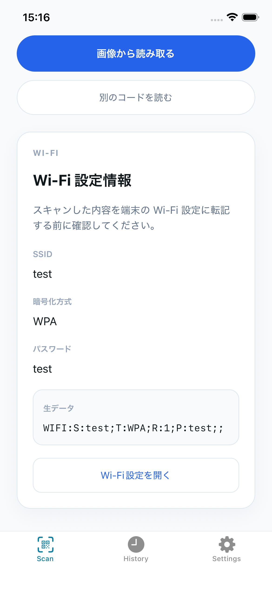
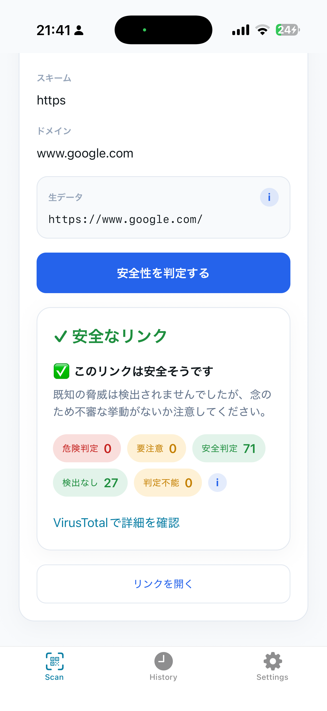
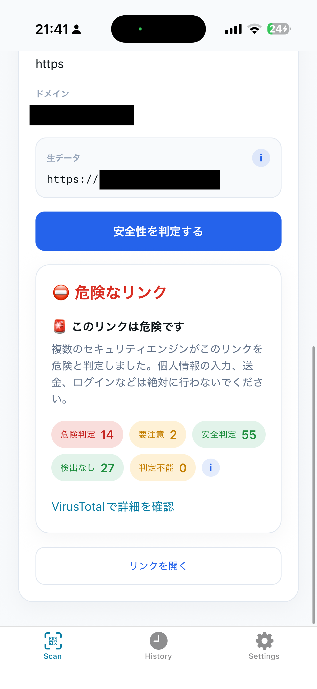
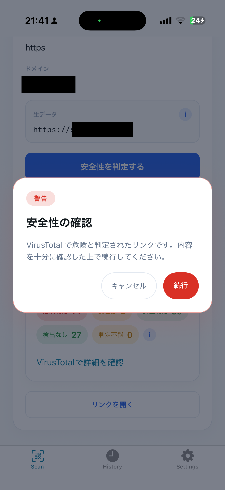
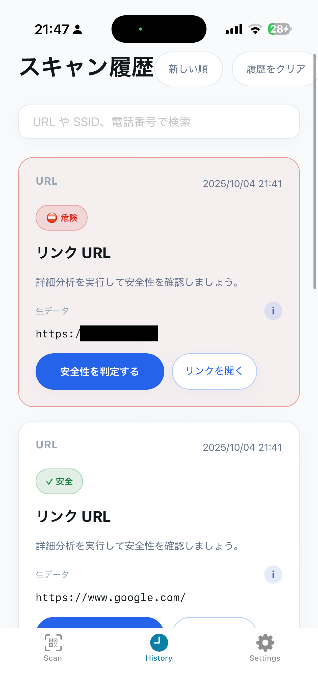

# Secure Code Reader - 使い方ガイド

このドキュメントでは、Secure Code Reader の具体的な使い方を画像付きで説明します。

## 目次
- [アプリの起動](#アプリの起動)
- [スキャンタブの使い方](#スキャンタブの使い方)
- [履歴タブの使い方](#履歴タブの使い方)
- [設定タブの使い方](#設定タブの使い方)

---

## アプリの起動

アプリを起動すると、カメラへのアクセス許可を求められます。「許可」をタップしてください。

 **注意**: カメラの権限を許可しないと QR コードのスキャン機能が利用できません。

---

## スキャンタブの使い方

### 1. カメラでQRコードをスキャンする

アプリを起動すると、スキャンタブが表示されます。画面中央に表示される正方形のガイド枠に QR コードを合わせてください。

**ポイント:**
- QR コードがガイド枠内に収まるように調整してください
- 自動的に読み取りが開始されます
- 読み取りが完了すると、下部に結果が表示されます

### 2. 画像から読み取る

カメラでの読み取りの他に、既存の画像から QR コードを読み取ることもできます。

1. 画面下部の「画像から読み取る」ボタンをタップ
2. フォトライブラリから QR コードが含まれる画像を選択
3. 自動的に QR コードが解析されます

### 3. スキャン結果の確認

QR コードを読み取ると、ペイロードの種類に応じた結果カードが表示されます。

#### URL の場合

- **ペイロードタイプ**: URL であることが表示されます
- **元のテキスト**: QR コードに含まれていた生のテキスト
- **ホスト名**: URL のドメイン情報
- **リンクを開く**: ブラウザでリンクを開きます
- **安全性を判定する**: VirusTotal で URL の安全性をチェックします

#### 電話番号の場合

- **ペイロードタイプ**: 電話番号であることが表示されます
- **電話番号**: 抽出された電話番号
- **電話をかける**: 標準の電話アプリで発信画面を開きます

#### Wi-Fi 設定の場合

- **ペイロードタイプ**: Wi-Fi であることが表示されます
- **SSID**: ネットワーク名
- **暗号化方式**: セキュリティタイプ (WPA/WPA2 など)
- **Wi-Fi 設定を開く**: デバイスの Wi-Fi 設定画面を開きます

### 4. URL の安全性チェック

URL が検出された場合、VirusTotal を使って安全性をチェックできます。

1. 「安全性を判定する」ボタンをタップ
2. VirusTotal での解析が開始されます
3. 解析中は「解析中...」と表示されます

#### 判定結果

解析が完了すると、以下のいずれかの判定結果が表示されます:

**安全な場合**

- 緑色で「安全」と表示されます
- そのまま「リンクを開く」で安心してアクセスできます

**注意が必要な場合**

- オレンジ色で「注意」と表示されます
- リンクを開く際に確認ダイアログが表示されます

**危険な場合**

- 赤色で「危険」と表示されます
- リンクを開く際に必ず警告ダイアログが表示されます
- アクセスは推奨されません

### 5. リンクを開く際の確認ダイアログ

「注意」や「危険」と判定された URL、または設定で「強警告を常に表示」を有効にしている場合、リンクを開く前に確認ダイアログが表示されます。

- **キャンセル**: リンクを開かずに戻ります
- **開く**: 注意を承知の上でリンクを開きます

---

## 履歴タブの使い方

### 1. スキャン履歴の一覧

これまでスキャンした QR コードの履歴が最新 50 件まで保存されます。

**表示される情報:**
- ペイロードタイプ (URL / 電話番号 / Wi-Fi / テキスト)
- 元のテキストまたは主要情報
- スキャン日時
- 安全性判定結果 (URL の場合)

### 2. 履歴の検索とソート

履歴の上部には検索バーとソートボタンがあります。

**検索機能:**
- テキスト入力で履歴を絞り込むことができます
- URL、電話番号、Wi-Fi名などで検索可能

**ソート機能:**
- 「新しい順」: 最新のスキャンが上に表示されます (デフォルト)
- 「古い順」: 古いスキャンが上に表示されます
---

## 設定タブの使い方

アプリの動作をカスタマイズできます。

### 1. VirusTotal を利用して詳細判定

- **オン (デフォルト)**: URL スキャン時に VirusTotal API を使って安全性をチェックします
- **オフ**: VirusTotal を使用せず、基本的な情報のみを表示します

> BFF 経由で利用している場合も、この設定が適用されます。

### 2. 強警告を常に表示

- **オン**: すべてのリンクを開く際に確認ダイアログを表示します
- **オフ (デフォルト)**: 「注意」「危険」判定のリンクのみ確認ダイアログを表示します

---

ご不明な点やバグ報告は、[GitHub Issues](https://github.com/CSTmatsunolab/secure-code-reader/issues) までお願いします。
